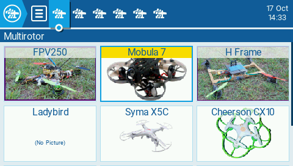

# Themes directory for third party themes for EdgeTX

*Initial Draft Specification - subject to change!*

A theme for EdgeTX consists of 5 files, all sharing the initial part of the filename (**themefile** in this example):
  - **themefile**.yml (you theme configuration file with name, summary, and color settings)
  - **themefile**.png (a logo/banner for your theme) 
    
  - **themefile**1.png (first screenshot, of the main screen with some common widgets selected) 
    
  - **themefile**2.png (second screenshot, of model selection screen with at least two models present) 
    
  - **themefile3**.png (third screenshot, of the channel monitor) 
    

Optional:
  - themefile_background.png (a background image for your theme)
  - themefile_readme.txt (any notes or information you wish to share with your theme)

Images should all be in PNG format, and 225 x 128 pixels in size.

Please refer to the `example` folder for an example of the expected layout.

Please refer to TODO documentation for more information on the theme file format.

## If you are new to GitHub here are the steps to follow in order to contribute

<ol>
  <li>If you do not yet have a GitHub account, create it (it is free)</li>
  <li>Fork this repo by clicking <code>Fork</code> in upper right</li>
  <li>Make a branch (by clicking down arrow at "main" and typing an arbitrary name without spaces, e.g. "mytesttheme" and clicking "Create branch")</li>
  <li>Commit your changes to your newly created branch.
     You can work via GitHub Web interface or optionally you can do this also locally. Instructions for local command line would be:
     <code>git clone -b mytesttheme https://github.com/<your user name in GitHub>/themes.git ~/edgetx/themes</code>
     Then add the files with <code>git add</code>, followed by a commit with <code>git commit -m "commitmessagehere"</code> and then push with <code>git push</code>
   If you are a Windows user and looking for a graphical tool for Git, have a look at e.g. <a href="https://tortoisegit.org/">TortoiseGit</a></li>
  <li>Make a pull request by clicking the big green "Compare & Pull Request" button in GitHub in your fork's branch.</li>
</ol>
